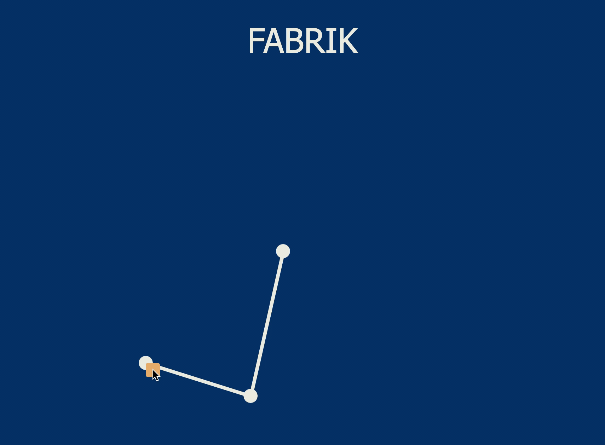

# FABRIK

A p5.js implementation of the FABRIK algorithm. 
FABRIK is a fast, iterative solver for the inverse kinematics problem.

Inverse Kinematics is a method for computing the posture via estimating each individual degree of freedom in order to satisfy a given task that meets user constraints; it plays an important role in the computer animation and
simulation of articulated figures.

[Paper](http://andreasaristidou.com/publications/papers/FABRIK.pdf)

Here it is with random link lengths.

